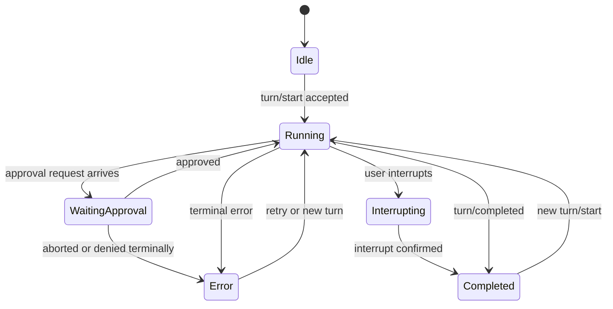
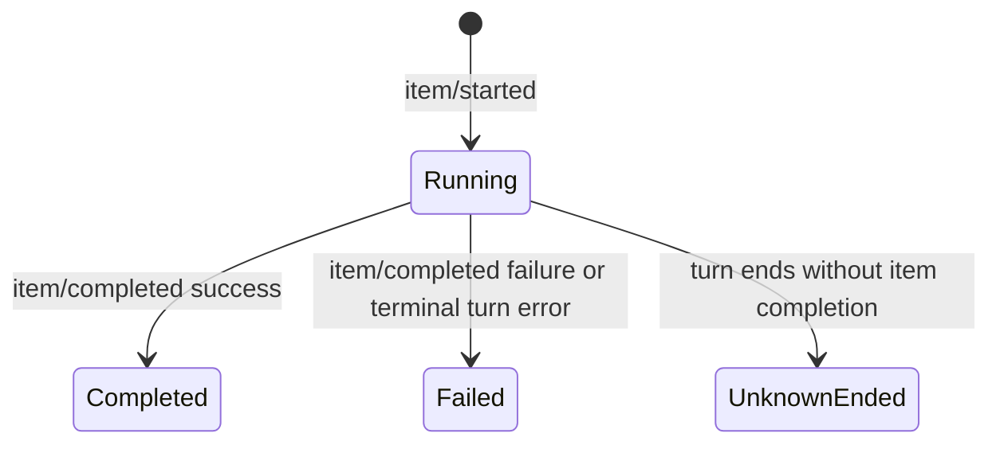
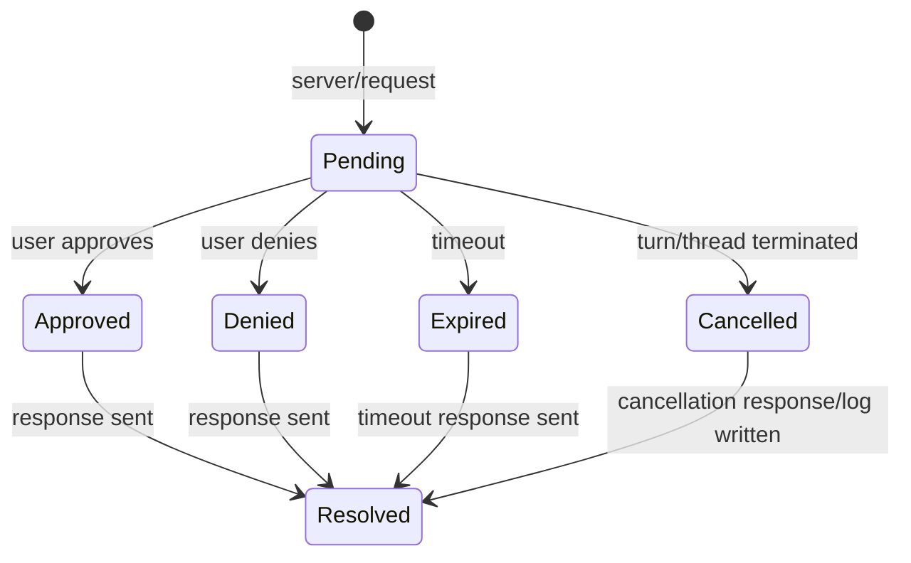

# RFC 0002: Codex App-Server 协议内核

- 状态：Draft
- 作者：Sunlab Desktop Architecture Group
- 更新时间：2026-08-23
- 上游依赖：Codex CLI `codex app-server`
- 相关文档：[RFC 0001](./0001-platform-architecture.md)

## 1. 摘要

本文定义 Sunlab Desktop 与 `codex app-server` 之间的协议内核，包括传输分帧、请求生命周期、事件归一化、线程状态机、审批协调、故障恢复和测试要求。

协议内核的目标是：无论上层 UI 如何变化，Agent 会话状态始终一致、可追踪、可恢复、可测试。

## 2. 设计目标

1. 单一协议入口：React 只能调用 Client Core，不允许直接拼 JSON-RPC。
2. 显式状态机：app-server、request、thread、turn、item、approval 都有明确状态。
3. 可回放：关键通知写入 append-only journal，可重建 UI 所需状态。
4. 容错：能处理进程崩溃、慢响应、重复事件、迟到 delta、乱序通知。
5. 可替换：stdio 只是第一传输层；未来可替换为 unix socket 或 remote endpoint。

## 3. 传输层

### 3.1 第一阶段：stdio NDJSON

Rust Host 使用如下方式启动：

```bash
codex app-server --listen stdio://
```

每一帧是一个 UTF-8 JSON object，以 `\n` 结尾。

约束：

1. 一行 MUST 只包含一个 JSON-RPC message。
2. 解析失败的行 MUST 进入 raw log，不能导致 reader task 崩溃。
3. stdout 只用于协议；人类可读诊断信息 SHOULD 写入 stderr。
4. stderr MUST 被捕获到 supervisor log，不能直接丢弃。
5. Rust Host MUST 设置最大帧长度，防止异常子进程耗尽内存。

### 3.2 未来传输

后续 MAY 支持：

```text
unix:///path/to/sunlab-codex.sock
ws://127.0.0.1:<port>
remote+tls://gateway.sunlab.internal
```

切换传输时，JSON-RPC 语义和 Client Core API 不变。

## 4. JSON-RPC 消息模型

协议包含三类消息：

```ts
export type JsonRpcRequestId = number | string;

export type ClientRequest = {
  jsonrpc: "2.0";
  id: JsonRpcRequestId;
  method: string;
  params?: unknown;
};

export type ServerResponse = {
  jsonrpc: "2.0";
  id: JsonRpcRequestId;
  result?: unknown;
  error?: JsonRpcError;
};

export type PeerNotification = {
  jsonrpc: "2.0";
  method: string;
  params?: unknown;
};

export type ServerRequest = {
  jsonrpc: "2.0";
  id: JsonRpcRequestId;
  method: string;
  params?: unknown;
};
```

### 4.1 请求 ID

Rust Host 生成的本地请求 ID SHOULD 使用单调递增整数。

原因：

1. 便于排序和 trace。
2. 避免 string ID 冲突。
3. pending map 查找简单。

Server request 的 ID 由 app-server 决定，Client Core MUST 支持 number 和 string。

### 4.2 方法命名空间

核心方法分组：

| 分组 | 示例 | 说明 |
| --- | --- | --- |
| lifecycle | `initialize` | 建立 app-server 会话。 |
| thread | `thread/start`, `thread/resume`, `thread/list`, `thread/read` | 线程生命周期和历史。 |
| turn | `turn/start`, `turn/interrupt`, `turn/steer` | 驱动一次 Agent 执行。 |
| item | `item/started`, `item/completed`, `item/agentMessage/delta` | 时间线内容。 |
| approval | command/file/network/MCP approval server requests | 高风险操作确认。 |
| model/account | `model/list`, `account/read` | 配置和账户状态。 |
| extension | MCP/skills/plugins 相关方法 | 由适配层封装。 |

实际字段和方法名 MUST 以当前版本的 `generate-json-schema` 输出为准。

### 4.3 错误模型

Client Core 定义统一错误：

```ts
export type ProtocolErrorKind =
  | "transportClosed"
  | "timeout"
  | "invalidFrame"
  | "serverRejected"
  | "cancelled"
  | "approvalDenied"
  | "unsupportedMethod"
  | "unknown";

export type ProtocolError = {
  kind: ProtocolErrorKind;
  message: string;
  code?: number | string;
  data?: unknown;
  requestId?: JsonRpcRequestId;
  retryable: boolean;
};
```

映射建议：

| 场景 | kind | retryable |
| --- | --- | --- |
| stdin/stdout pipe broken | `transportClosed` | true |
| response timeout | `timeout` | 视方法而定 |
| JSON-RPC error code `-32601` | `unsupportedMethod` | false |
| user decline approval | `approvalDenied` | false |
| frame parse failure | `invalidFrame` | false |
| explicit cancel | `cancelled` | false |

## 5. Rust Host API

Tauri command 只做薄包装。

```ts
export interface NativeBridge {
  startAppServer(): Promise<void>;
  stopAppServer(): Promise<void>;
  request(method: string, params?: unknown): Promise<unknown>;
  resolveServerRequest(id: string | number, result: unknown): Promise<void>;
}
```

事件：

```ts
type NativeEvent =
  | {
      type: "notification";
      method: string;
      params?: unknown;
    }
  | {
      type: "serverRequest";
      id: string | number;
      method: string;
      params?: unknown;
    }
  | {
      type: "supervisor";
      state:
        | "starting"
        | "initializing"
        | "ready"
        | "degraded"
        | "restarting"
        | "failed"
        | "stopped";
      detail?: unknown;
    };
```

当前原型将 notification/serverRequest 合并成一个事件，R1 SHOULD 拆分，避免 UI 把 peer request 当普通通知处理。

## 6. ProtocolClient

### 6.1 接口

```ts
export interface ProtocolClient {
  request<TParams, TResult>(
    method: string,
    params?: TParams,
    options?: RequestOptions,
  ): Promise<TResult>;

  notify(method: string, params?: unknown): Promise<void>;

  onNotification<T>(
    method: string,
    handler: (params: T) => void | Promise<void>,
  ): Unsubscribe;

  onServerRequest<T>(
    predicate: (method: string, params: T) => boolean,
    handler: (request: ServerRequestContext<T>) => void,
  ): Unsubscribe;

  resolveServerRequest(
    id: string | number,
    result: unknown,
  ): Promise<void>;
}
```

### 6.2 Request Manager

每个请求记录：

```ts
type PendingRequest = {
  id: number;
  method: string;
  startedAtMs: number;
  timeoutMs?: number;
  controller: AbortController;
  resolve: (value: unknown) => void;
  reject: (error: ProtocolError) => void;
};
```

规则：

1. 同一 id 只能有一个 pending entry。
2. 收到 response 后立即删除 pending entry。
3. 进程退出时所有 pending request MUST reject with `transportClosed`。
4. 默认请求超时为 30 秒；`initialize` 为 10 秒。
5. 明确长时间等待的操作 MUST 在 options 中设置 timeout，而不是全局放大。

### 6.3 取消语义

本地取消不等于远端取消。

如果用户中断 turn：

1. Client Core MUST 发送 `turn/interrupt`。
2. 同时标记对应 turn 为 `interrupting`。
3. 只有收到明确 completed/error/interrupted 事件后才进入终态。

如果只是关闭 UI 页面：

1. 不应中断后台 turn。
2. 重新进入线程时 MUST 从 app-server 或 journal 恢复状态。

## 7. 事件归一化

### 7.1 本地 Sequence

Event Store 为每条进入 Client Core 的消息分配全局递增：

```ts
type StoredMessage = {
  seq: number;
  receivedAtMs: number;
  direction: "incoming" | "outgoing";
  kind: "request" | "response" | "notification" | "serverRequest" | "serverResponse";
  method?: string;
  requestId?: number | string;
  threadId?: string;
  turnId?: string;
  itemId?: string;
  payload: unknown;
};
```

`seq` 用于 replay 和调试，不假设 app-server 保证全序。

### 7.2 核心实体

```ts
export type ThreadSummary = {
  id: string;
  title?: string;
  cwd?: string;
  projectId?: string;
  createdAtMs?: number;
  updatedAtMs?: number;
  status: ThreadStatus;
  preview?: string;
};

export type ThreadStatus =
  | "idle"
  | "running"
  | "waitingApproval"
  | "interrupting"
  | "error"
  | "archived";

export type Turn = {
  id: string;
  threadId: string;
  status: TurnStatus;
  input: unknown[];
  items: Map<string, TimelineItem>;
  startedAtMs?: number;
  endedAtMs?: number;
  error?: ProtocolError;
};

export type TurnStatus =
  | "starting"
  | "running"
  | "waitingApproval"
  | "completed"
  | "failed"
  | "interrupting"
  | "interrupted";

export type TimelineItem = {
  id: string;
  threadId: string;
  turnId: string;
  type: string;
  status: "running" | "completed" | "failed";
  text: string;
  data: unknown;
  localSeqCreated: number;
  localSeqUpdated: number;
  localSeqCompleted?: number;
};
```

具体字段名以官方 schema 生成的类型为准，上述结构是 Client Core 的内部投影。

### 7.3 Delta 合并规则

对 streaming text：

1. `item/started` 创建 item，状态为 `running`。
2. delta 按 `itemId` 追加文本。
3. `item/completed` 使用服务端 snapshot 覆盖本地累积结果。
4. 如果 completed 到达晚于某些 delta，completed MUST 胜出。
5. 如果 completed 缺失，reducer 在 thread/turn 终态时将 running item 标记为 `unknown-ended`，不能永远显示 loading。

### 7.4 去重

事件去重 key 建议：

```text
<direction>:<method>:<requestId|threadId>:<turnId>:<itemId>:<canonicalPayloadHash>
```

对于生命周期事件，MAY 直接使用 `<method>:<entityId>` 做幂等处理。

## 8. Thread State Machine

### 8.1 线程级状态



### 8.2 Item 状态



UI 不应对 `UnknownEnded` 显示无限 spinner。

## 9. 初始化与会话恢复

### 9.1 Initialize

启动后 Rust Host 发送：

```json
{
  "jsonrpc": "2.0",
  "id": 1,
  "method": "initialize",
  "params": {
    "clientInfo": {
      "name": "sunlab-desktop",
      "title": "Sunlab Desktop",
      "version": "0.1.0"
    }
  }
}
```

Client Info MUST 包含真实应用版本，便于服务端诊断。

### 9.2 进程重启恢复

当 app-server 崩溃：

1. Supervisor 记录 exit code 和 stderr tail。
2. 所有 pending request reject。
3. 当前 running turns 标记为 `unknown`，不能直接标成功。
4. Supervisor 按指数退避重启。
5. 初始化成功后尝试恢复最近活跃线程。
6. 对无法确认状态的 turn，UI MUST 提示“状态未知，可选择重新发送或检查工作区”。

### 9.3 桌面重启恢复

启动流程：

1. 从本地 cache 读取 thread summaries。
2. 初始化 app-server。
3. 调用 `thread/list` 或等效方法刷新。
4. 用户进入线程时调用 `thread/resume` / `thread/read`。
5. 合并本地 journal 与服务端返回。

合并优先级：

1. 服务端 completed snapshot 最高。
2. 本地 completed snapshot 次之。
3. 本地 delta 只用于补齐缺失过程信息。
4. 冲突状态显示诊断信息，不静默伪造成功。

## 10. 审批协调

### 10.1 Server Request 分类

已知审批类 server request 包括但不限于：

```text
item/commandExecution/requestApproval
item/fileChange/requestApproval
item/permissions/requestApproval
mcpServer/elicitation/request
applyPatchApproval
execCommandApproval
```

Client Core MUST 将其转换为统一 `ApprovalRecord`。

### 10.2 生命周期



### 10.3 响应约定

不同 approval response 的 result 结构不同。Client Core MUST 为每种 server request 注册 resolver：

```ts
interface ApprovalResolver<TParams, TResult> {
  method: string;
  parse(params: unknown): TParams;
  approve(params: TParams): TResult;
  deny(params: TParams): TResult;
}
```

禁止 UI 直接构造协议 result。

### 10.4 审计记录

每次决定写入：

```json
{
  "at": "2026-08-23T12:00:00Z",
  "approvalId": "...",
  "kind": "command",
  "threadId": "...",
  "decision": "approved",
  "scope": "once",
  "risk": "high",
  "origin": "user",
  "summaryHash": "..."
}
```

Audit record SHOULD 保存完整 payload hash 和必要摘要，避免无限增长。

## 11. 持久化

### 11.1 Event Journal

每个线程目录保存：

```text
events.ndjson
snapshots/latest.json
meta.json
```

写入顺序：

1. append event to journal.
2. update in-memory state.
3. periodically compact snapshot.

Journal MUST 支持损坏尾部截断。最后一行不完整时应保留合法前缀并告警。

### 11.2 Snapshot

Snapshot 包含：

```json
{
  "version": 1,
  "threadId": "...",
  "lastSeq": 1024,
  "threads": {},
  "turns": {},
  "items": {},
  "approvals": {}
}
```

Snapshot version 不兼容时 MUST 重建或引导用户重新拉取服务端状态。

## 12. Fake App-Server

R1 MUST 实现 fake app-server，用于离线测试。

支持模式：

```text
fake-app-server --scenario happy-path
fake-app-server --scenario approval-command
fake-app-server --scenario slow-delta
fake-app-server --scenario out-of-order
fake-app-server --scenario crash-after-turn-start
fake-app-server --scenario malformed-frame
```

每个 scenario 都是确定性脚本，可用于 golden test。

## 13. Contract Testing

### 13.1 Schema Generation

CI 定期执行：

```bash
codex app-server generate-json-schema \
  --experimental \
  --out /Volumes/fushilu/.caches/sunlab/schema/<codex-version>
```

然后生成 TypeScript 类型。

### 13.2 必测矩阵

| 场景 | 断言 |
| --- | --- |
| initialize 成功 | supervisor 进入 ready。 |
| initialize 返回错误 | supervisor failed，pending 清空。 |
| thread/start 成功 | thread summary 存在且 idle。 |
| turn/start 成功 | turn 进入 starting/running。 |
| agent delta | text 增量追加且只影响目标 item。 |
| item completed | snapshot 覆盖 delta。 |
| approval denied | approval resolved 且 audit 写入。 |
| process crash | pending rejected，supervisor restarting。 |
| malformed frame | reader 不退出，raw log 记录。 |

## 14. 性能预算

在普通笔记本上：

1. 单线程 1000 个 item 渲染不应阻塞输入。
2. delta 到达到 DOM 更新 P95 < 100ms。
3. journal append 不应在 UI 主线程同步执行大量序列化。
4. protocol trace 开启时整体吞吐下降不超过 20%。

虚拟化 timeline 是 R2/R3 的必要能力。

## 15. 迁移方案

当前实现迁移到 R1：

1. 将 `src-tauri/src/lib.rs` 拆分为 `supervisor.rs`、`transport.rs`、`commands.rs`。
2. 将通知拆成 `protocol://notification`、`protocol://server-request`、`protocol://supervisor`。
3. 前端新建 `src/core/protocol`，移除 `App.tsx` 中的事件 switch。
4. 增加 fake app-server 和 reducer tests。
5. 保持现有 UI 可用，但逐步改为消费 selector。

## 16. 验收标准

R1 完成的最低标准：

1. 官方 schema 类型可在 CI 中重新生成。
2. 所有协议流量经过 `ProtocolClient`。
3. thread/turn/item/approval 有 reducer 和单元测试。
4. app-server 崩溃后有明确 supervisor 状态。
5. fake app-server 能模拟至少六个异常场景。
6. React UI 不再包含原始 method 字符串分支。
