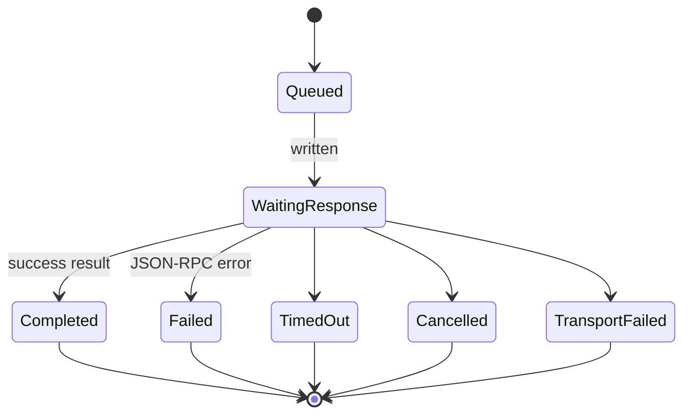
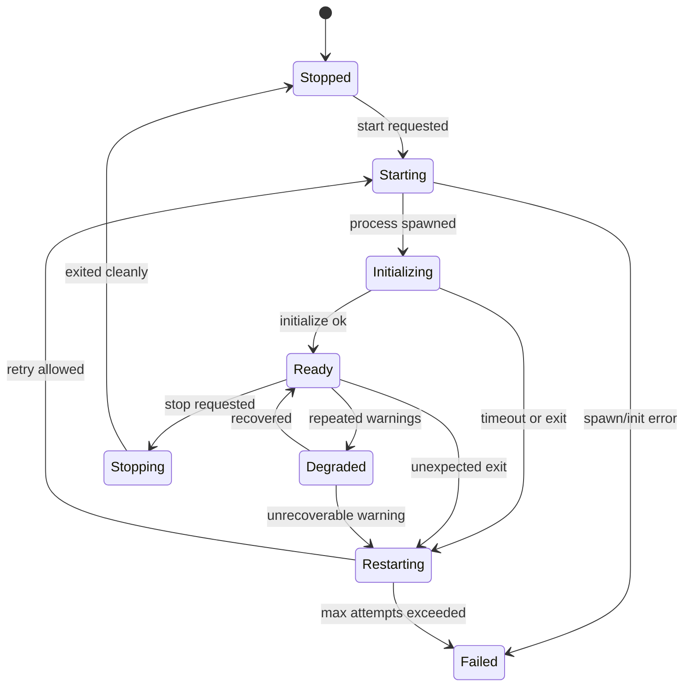
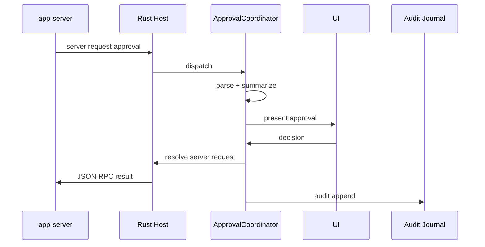

# RFC 0005: R1 Protocol Kernel 工程执行计划

- 状态：Draft
- 作者：Sunlab Desktop Architecture Group
- 更新时间：2026-08-24
- 依赖文档：
  - [RFC 0001](./0001-platform-architecture.md)
  - [RFC 0002](./0002-protocol-kernel.md)
  - [RFC 0004](./0004-dependency-upstream-strategy.md)

## 1. 摘要

本文把 R1 Protocol Kernel 拆解为可独立评审、可并行推进、可持续集成的工程任务。

R1 的目标不是继续增加产品功能，而是建立一条稳定、可测试、可回放、可随上游演进的协议内核：

```text
codex app-server
  -> Rust Supervisor + Transport
    -> ProtocolClient
      -> Event Store / Reducer
        -> React Selectors
```

R1 完成后，UI 可以继续简陋，但底层必须满足：

1. 所有协议流量都有类型、trace 和测试。
2. app-server 崩溃、超时、乱序、审批、重连都有确定性行为。
3. thread / turn / item / approval 状态由 reducer 统一推导。
4. fake app-server 能离线复现关键故障场景。
5. React 不再直接解析原始 JSON-RPC method。

## 2. 当前基线

当前仓库已经具备：

| 能力 | 状态 |
| --- | --- |
| Tauri 2 + React + TypeScript | 已完成 |
| `codex app-server` stdio 启动 | 已完成 |
| JSON-RPC request/response 转发 | 已完成 |
| notification / server-request / supervisor 事件拆分 | 初步完成 |
| thread / turn / item / approval reducer | 第一版完成 |
| deterministic fake scenarios | 测试级 fake 完成 |
| schema 类型生成 | 未接入 CI |
| event journal 持久化 | 未实现 |
| supervisor 自动重启 / backoff / stderr ring buffer | 未实现 |
| React selector 迁移 | 未完成 |

R1 采用增量迁移策略：每一波都不能长期破坏现有“连接 Codex、创建线程、发送消息、显示输出”的主链路。

## 3. R1 范围

### 3.1 In Scope

1. Rust Host 目录重构与模块边界。
2. Codex schema generation 与 protocol contract gate。
3. ProtocolClient / Transport / RequestManager 正式化。
4. Thread / Turn / Item / Approval reducer 补全。
5. Event journal 与 snapshot。
6. Fake App Server 与 golden fixtures。
7. Supervisor lifecycle、backoff、health、stderr capture。
8. Approval Coordinator。
9. React selector 迁移。
10. CI contract matrix。

### 3.2 Out of Scope

1. 插件运行时。
2. Workflow Engine。
3. Marketplace / registry。
4. 多设备同步。
5. 复杂 Git UI。
6. 完整 settings UI。
7. 生产签名分发。
8. 非 stdio transport。

这些能力依赖 R1 的状态模型和协议稳定性，不应提前展开。

## 4. 目标目录结构

### 4.1 Rust Native Host

```text
src-tauri/src/
├── main.rs
├── lib.rs
├── commands/
│   ├── mod.rs
│   ├── app_server.rs
│   └── journal.rs
├── config/
│   ├── mod.rs
│   └── runtime.rs
├── error/
│   ├── mod.rs
│   └── codes.rs
├── events/
│   ├── mod.rs
│   └── payload.rs
├── supervisor/
│   ├── mod.rs
│   ├── lifecycle.rs
│   ├── health.rs
│   ├── restart_policy.rs
│   └── stderr_buffer.rs
├── transport/
│   ├── mod.rs
│   ├── codec.rs
│   ├── frame.rs
│   ├── request_manager.rs
│   └── server_requests.rs
└── test_support/
    ├── mod.rs
    └── fake_runtime.rs
```

`lib.rs` 只保留 Tauri Builder 注册逻辑。业务函数不得继续堆在单文件根作用域。

### 4.2 Frontend Client Core

```text
src/core/
├── protocol/
│   ├── client.ts
│   ├── transport.ts
│   ├── messages.ts
│   ├── errors.ts
│   ├── state.ts
│   ├── reducer/
│   │   ├── thread.ts
│   │   ├── turn.ts
│   │   ├── item.ts
│   │   └── approval.ts
│   ├── selectors/
│   │   ├── threadSelectors.ts
│   │   ├── timelineSelectors.ts
│   │   └── approvalSelectors.ts
│   └── generated/
│       └── codex/
│           └── <runtime-version>/
├── journal/
│   ├── eventJournal.ts
│   ├── snapshotStore.ts
│   └── replay.ts
├── approval/
│   ├── coordinator.ts
│   ├── resolvers/
│   └── types.ts
└── testing/
    ├── fakeAppServer.ts
    ├── fixtures/
    └── time.ts
```

第一版不急于抽成独立 pnpm package。当 reducer 和 SDK API 稳定后，再移动到：

```text
packages/protocol-core
packages/testing
packages/plugin-sdk
```

## 5. 工作流总览

```text
W0 Baseline Freeze
  ↓
W1 Directory & Module Refactor
  ↓
W2 Schema Contract Pipeline
  ↓
W3 Transport & Request Manager
  ↓            \
W4 Reducer & Journal       W5 Supervisor Stability
  \                       /
   -> W6 Approval Coordinator
             ↓
   W7 Fake Server & Fixtures
             ↓
   W8 React Selector Migration
             ↓
   W9 CI Matrix & Release Gate
```

部分任务可以并行，但 W1 必须先完成，否则后续 review 会持续冲突。

## 6. Workstream 0: Baseline Freeze

### 目标

在重构前固定当前可用行为，避免迁移期间丢失真实主链路。

### Tasks

#### T0.1 冒烟脚本化

新增：

```text
scripts/smoke/codex-handshake.mjs
scripts/smoke/thread-start.mjs
```

要求：

1. 使用本机 `codex` 或 `SUNLAB_CODEX_BIN`。
2. 发送 `initialize`。
3. 发送 `thread/start`。
4. 输出 normalized result 到 NDJSON。
5. 支持超时和非零退出。

#### T0.2 协议 trace 开关

新增环境变量：

```bash
SUNLAB_PROTOCOL_TRACE=stdout|file|off
SUNLAB_TRACE_DIR=/Volumes/fushilu/.caches/sunlab/logs
```

Rust 层记录：

```json
{
  "at": "...",
  "direction": "outgoing",
  "kind": "request",
  "method": "initialize",
  "id": 1,
  "bytes": 128,
  "payload": {}
}
```

默认脱敏，不得记录 token、cookie、完整 secret。

#### T0.3 建立当前 golden smoke fixture

保存脱敏后的最小事件流：

```text
src/core/testing/fixtures/v0-alpha/current/
├── initialize.ndjson
├── thread-start.ndjson
├── happy-turn.ndjson
├── command-approval.ndjson
└── late-delta.ndjson
```

### Acceptance

1. 本地命令能一键跑握手和线程启动冒烟。
2. trace 可开关且不会影响正常请求。
3. 至少五个 fixture 进入仓库。

## 7. Workstream 1: Directory and Module Refactor

### 目标

消除 `src-tauri/src/lib.rs` 单文件职责，建立可测试的 native host 分层。

### Tasks

#### T1.1 抽取 Error Model

新增：

```rust
// src-tauri/src/error/mod.rs
pub enum HostError {
    SpawnFailed,
    TransportClosed,
    InvalidFrame,
    PendingNotFound,
    Timeout,
    RuntimeUnavailable,
    ConfigInvalid,
}
```

所有 `Result<(), String>` 最终替换为 `Result<T, HostError>`。

Tauri boundary 仍可序列化为前端友好结构：

```json
{
  "kind": "spawnFailed",
  "message": "unable to start codex",
  "retryable": true
}
```

#### T1.2 抽取 Runtime Config

配置字段：

```rust
pub struct RuntimeConfig {
    pub codex_binary: PathBuf,
    pub codex_home: Option<PathBuf>,
    pub args: Vec<String>,
    pub max_frame_bytes: usize,
    pub initialize_timeout_ms: u64,
    pub default_request_timeout_ms: u64,
}
```

来源优先级：

1. 显式 developer settings。
2. `SUNLAB_CODEX_BIN`。
3. bundled runtime。
4. PATH。

#### T1.3 抽取 Codec

`transport/codec.rs` 负责：

1. byte stream to line。
2. line to JSON value。
3. max frame guard。
4. malformed frame classification。
5. oversized frame protection。

单元测试必须覆盖：

1. 多个 JSON 在同一 chunk。
2. 一个 JSON 跨多个 chunk。
3. 尾部无 newline。
4. UTF-8 边界。
5. 超过 max frame。
6. 空 whitespace 行。

#### T1.4 抽取 RequestManager

```rust
pub struct RequestManager {
    pending: HashMap<u64, PendingRequest>,
    next_id: AtomicU64,
}
```

行为：

1. register。
2. resolve。
3. reject。
4. timeout sweep。
5. fail_all_on_transport_closed。

#### T1.5 抽取 Event Emitter Payload

统一三个 channel：

```rust
pub enum NativeEvent {
    Notification { method: String, params: Value },
    ServerRequest { id: Value, method: String, params: Value },
    Supervisor(SupervisorEvent),
}
```

禁止在 Rust 中散落硬编码 event name。

#### T1.6 保持旧 UI 兼容

重构分两个 PR：

1. PR-A：纯 Rust 模块搬移，不改外部行为。
2. PR-B：前端切换到 canonical event names。

### Acceptance

1. `lib.rs` 不包含 spawn/read/write/pending 具体实现。
2. codec/request manager 有独立单元测试。
3. `cargo check` 和现有前端测试保持通过。
4. 手工 smoke 主链路不回归。

## 8. Workstream 2: Schema Contract Pipeline

### 目标

让上游协议变化在合并前可见，而不是等到运行时才发现 response shape 改了。

### Tasks

#### T2.1 版本探测

脚本读取：

```bash
codex --version
```

输出 normalized：

```json
{
  "version": "0.149.0-alpha.4",
  "channel": "alpha",
  "commit": null
}
```

如果版本不可解析，schema job MUST fail with explicit reason。

#### T2.2 Raw Schema Cache

生成目录：

```bash
/Volumes/fushilu/.caches/sunlab/schema/codex/<version>/
```

内容：

```text
codex_app_server_protocol.schemas.json
codex_app_server_protocol.v2.schemas.json
ClientRequest.json
ServerNotification.json
ServerRequest.json
manifest.json
```

`manifest.json` 包含：

```json
{
  "version": "0.149.0-alpha.4",
  "generatedAt": "...",
  "experimental": true,
  "hash": "..."
  }
```

#### T2.3 Core Method Projection

不要第一版直接把全部 schema 转成 TS 并提交。官方 alpha schema 很大且可能频繁变化。

先维护 core projection：

```text
src/core/protocol/schema/codex-core.v1.json
```

覆盖方法：

```text
initialize
thread/start
thread/list
thread/read
thread/resume
turn/start
turn/interrupt
item/started
item/completed
item/agentMessage/delta
turn/completed
error
item/commandExecution/requestApproval
item/fileChange/requestApproval
```

projection 从 raw schema 抽取 definitions，不手写字段名。

#### T2.4 Schema Diff Report

CI 对比 current baseline 与 candidate：

输出：

```text
reports/schema-diff.json
reports/schema-diff.md
```

分类：

| 变更 | gate |
| --- | --- |
| 新增 optional field | warning |
| 新增 method | warning + feature flag |
| 删除 core method | block |
| required field 新增 | block |
| response type 收窄 | block |
| enum 删除值 | block if used |
| approval result shape 变更 | block approval coordinator release |

#### T2.5 Generated Types Strategy

分两步：

**Phase A：Core hand-maintained types**

```ts
export type InitializeParams = {
  clientInfo: ClientInfo;
};
```

这些类型 MUST 由 projection 校验。

**Phase B：Full generated types**

当上游稳定后引入：

```text
src/core/protocol/generated/codex/<version>/...
```

生成物 SHOULD 经过 formatter 和 tree-shaking 检查，避免一次性提交数万行低价值代码。

#### T2.6 Contract Test Runner

Vitest tests：

1. validate request params against projection。
2. validate response result against projection。
3. validate notification params against projection。
4. detect unknown core methods。
5. ensure generated manifest version matches lockfile expectation。

### Acceptance

1. 一条命令能生成 raw schema cache。
2. 一条命令能生成 schema diff report。
3. CI 在 breaking change 时失败。
4. 核心方法有 TypeScript types。
5. fixture 中出现未知 required field 时测试失败。

## 9. Workstream 3: Transport and Request Manager

### 目标

让 Rust Host 的传输层具备生产语义：超时、取消、背压、关闭顺序。

### Tasks

#### T3.1 Request Lifecycle

状态：



#### T3.2 Timeout Policy

默认：

| method group | timeout |
| --- | --- |
| `initialize` | 10s |
| `thread/start` | 30s |
| `thread/*` read/list | 30s |
| `turn/start` | 30s |
| account/model metadata | 20s |
| unknown | 30s |

timeout 不代表远端停止执行。对于 `turn/start`，timeout 后 UI 应进入 `unknown`，不能标记 failed。

#### T3.3 Cancellation

本地 cancel 只释放 pending entry。

远端 cancel 必须显式发送对应方法，例如 `turn/interrupt`。

API：

```ts
const controller = new AbortController();
await client.request("turn/start", params, {
  signal: controller.signal,
});
```

AbortSignal 不能假设服务端已经中断；ProtocolClient MUST 返回明确的 `cancelled-local` 语义。

#### T3.4 Backpressure

写入 stdin 前：

1. 同一时间只允许一个 writer lock owner。
2. 写入失败立即 fail all pending。
3. stdout reader 不因单帧解析失败退出。
4. oversized frame 记录截断 hash 并丢弃。

#### T3.5 Graceful Shutdown

顺序：

```text
Stop accepting new requests
  -> Send optional interrupt/cancel for active turns
  -> Wait short grace period
  -> Drop stdin
  -> Wait process exit
  -> Kill after timeout
  -> Reap child
```

Windows/macOS/Linux 的 signal 行为分别测试。

### Acceptance

1. 每个 pending request 都会进入终态。
2. 进程死亡时所有 pending 收到 `transportClosed`。
3. malformed frame 不终止 reader。
4. graceful shutdown 无 zombie。
5. timeout 分类正确，特别是 `turn/start`。

## 10. Workstream 4: Reducer and Journal

### 目标

让 UI 状态从 append-only 协议事件确定性推导。

### Tasks

#### T4.1 拆分 Reducer

将 `state.ts` 拆为：

```text
reducer/thread.ts
reducer/turn.ts
reducer/item.ts
reducer/approval.ts
```

入口：

```ts
export function reduceKernel(
  state: KernelState,
  message: IncomingProtocolMessage,
): KernelState;
```

规则：

1. reducer 是 pure function。
2. 不调用 Date.now()，时间由 envelope 提供。
3. 不访问 network。
4. 不依赖 React。
5. 相同输入产生相同 output。

#### T4.2 Message Envelope

journal/replay 使用：

```ts
export type EnvelopedMessage = {
  seq: number;
  receivedAtMs: number;
  direction: "incoming" | "outgoing";
  message: IncomingProtocolMessage | OutgoingRecord;
};
```

#### T4.3 Item Reducer Detail

覆盖：

1. started before turn。
2. delta before started。
3. completed without started。
4. duplicate completed。
5. late delta after completed。
6. unknown item type。
7. item belongs to another thread。
8. missing threadId/turnId。

对无法安全归位的事件写入：

```ts
type DeadLetter = {
  reason:
    | "missingThread"
    | "missingTurn"
    | "unknownItem"
    | "duplicateTerminal";
  message: IncomingProtocolMessage;
};
```

Dead letter 不应静默丢弃。

#### T4.4 Snapshot Format

```json
{
  "version": 1,
  "threadId": "...",
  "lastSeq": 1024,
  "createdAtMs": 0,
  "state": {
    "threads": {},
    "turns": {},
    "items": {},
    "approvals": {}
  }
}
```

Snapshot 触发条件：

1. every 500 events。
2. thread reaches idle。
3. app shutdown。
4. journal size exceeds threshold。

#### T4.5 Rust Journal Service

Tauri commands：

```rs
journal_append(request)
journal_read(request)
journal_compact(request)
snapshot_save(request)
snapshot_load(request)
```

存储位置：

```text
/Volumes/fushilu/.caches/sunlab/cache/threads/<thread-id>/events.ndjson
```

安全约束：

1. thread-id 必须校验，禁止 path traversal。
2. 单条 event 上限。
3. append 使用 atomic buffered writer。
4. crash 后允许截断不完整 tail，但 MUST 记录 warning。

#### T4.6 Replay

```ts
export function replayJournal(events: EnvelopedMessage[]): KernelState;
```

支持：

1. from empty。
2. from snapshot。
3. skip invalid tail。
4. report replay diagnostics。

### Acceptance

1. 所有 reducer 时间可控。
2. golden fixture replay snapshot 稳定。
3. malformed journal tail 可恢复。
4. dead-letter 有测试。
5. UI selector 只消费 reduced state。

## 11. Workstream 5: Supervisor Stability

### 目标

让 app-server 成为受监督的外部运行时，而不是一次性 `tokio::spawn` 结果。

### Tasks

#### T5.1 Supervisor State Machine



#### T5.2 Restart Policy

初始策略：

```json
{
  "maxAttempts": 5,
  "initialBackoffMs": 500,
  "maxBackoffMs": 8000,
  "multiplier": 2,
  "jitterRatio": 0.2,
  "resetAfterReadyMs": 30000
}
```

分类：

| exit 场景 | 是否自动重启 |
| --- | --- |
| 用户主动 stop | no |
| binary not found | no |
| initialize rejected auth | no |
| crash during idle | yes |
| crash mid-turn | yes |
| OOM / kill | yes |
| repeated crash within window | backoff until max |

#### T5.3 Stderr Ring Buffer

保存最近：

```json
{
  "capacityBytes": 262144,
  "maxLines": 1000
  }
```

Supervisor event 附带 redacted tail：

```json
{
  "state": "failed",
  "exitCode": 101,
  "stderrTail": ["...", "..."]
}
```

必须过滤常见敏感模式：

1. bearer token。
2. api key。
3. cookie。
4. authorization header。
5. absolute home path 可选脱敏。

#### T5.4 Health Probe

轻量 probe 不需要额外 RPC，可以基于：

1. process exists。
2. stdin writable。
3. last incoming message age。
4. last request failure rate。
5. stderr error frequency。

输出：

```ts
type SupervisorHealth = {
  level: "healthy" | "degraded" | "unhealthy";
  reasons: string[];
  uptimeMs: number;
  restartAttempts: number;
  lastIncomingAtMs?: number;
};
```

#### T5.5 Runtime Override

开发模式支持：

```bash
SUNLAB_CODEX_BIN=./scripts/fake-codex-app-server.mjs \
SUNLAB_FAKE_SCENARIO=crash-after-turn-start \
pnpm tauri dev
```

生产构建 MUST NOT 默认允许任意 override。

#### T5.6 Crash Integration Tests

fake runtime 场景：

1. immediate exit。
2. no stdout handshake。
3. slow initialize。
4. valid init then exit。
5. invalid JSON flood。
6. huge stdout frame。
7. stderr flood。
8. stdin closed unexpectedly。
9. graceful SIGTERM。
10. kill -9。

### Acceptance

1. 每种异常都有明确 supervisor state。
2. 自动重启遵守 backoff。
3. stderr tail 出现在诊断事件中。
4. pending requests 在进程死亡后全部终态化。
5. 连续崩溃最终进入 Failed，而不是无限重启。

## 12. Workstream 6: Approval Coordinator

### 目标

把 approval server request 从 UI switch case 提升为独立协议协调器。

### Tasks

#### T6.1 Resolver Registry

```ts
export interface ApprovalResolver<TParams = unknown, TResult = unknown> {
  methods: string[];
  parse(params: unknown): TParams;
  summarize(params: TParams): ApprovalSummary;
  approve(params: TParams): TResult;
  deny(params: TParams): TResult;
}
```

第一批 resolver：

1. command execution approval。
2. file change approval。
3. permissions request approval。
4. MCP elicitation（只透传）。

#### T6.2 Approval Summary

```ts
export type ApprovalSummary = {
  title: string;
  risk: "low" | "medium" | "high" | "critical";
  bullets: string[];
  rawPayload: unknown;
  canApproveForSession: boolean;
  denyAction: "continue" | "abort";
};
```

command resolver 提取：

1. argv。
2. cwd。
3. shell join display。
4. writable roots。
5. network hints。
6. destructive pattern warning。

file resolver 提取：

1. patch summary。
2. files changed。
3. insertions/deletions。
4. sensitive file warning。

#### T6.3 Decision Flow



#### T6.4 Expiry and Thread Switch

1. approval 属于 thread/turn，不因切线程消失。
2. 全局 badge 显示 pending count。
3. turn interrupted 时 pending approval 进入 cancelled。
4. app-server exit 时 pending approvals 标记 unresolved。
5. 不自动拒绝，除非上游要求响应或定义了 timeout。

#### T6.5 Audit Record

```json
{
  "approvalId": "...",
  "method": "...",
  "decision": "approved",
  "scope": "once",
  "risk": "high",
  "summaryHash": "...",
  "decidedBy": "user",
  "at": "..."
}
```

完整 payload 存 raw journal，audit 存摘要。

### Acceptance

1. 新增 approval method 只需注册 resolver。
2. UI 不构造 protocol result。
3. 每个决定都有 audit。
4. pending approval 在进程崩溃后有明确终态策略。

## 13. Workstream 7: Fake App Server

### 目标

提供跨 Rust、TS、E2E 的统一离线运行时。

### Tasks

#### T7.1 Node CLI Fake Server

新增：

```text
scripts/fake-codex-app-server.mjs
```

接口：

```bash
node scripts/fake-codex-app-server.mjs \
  --scenario happy-turn \
  --delay-ms 10 \
  --fail-after initialize
```

支持场景：

```text
handshake-only
happy-turn
slow-delta
late-delta
out-of-order-items
command-approval
file-change-approval
deny-and-retry
turn-error
invalid-frame
huge-frame
crash-after-initialize
crash-after-turn-start
stderr-flood
hang-forever
```

#### T7.2 Scenario DSL

使用声明式 fixture：

```json
{
  "name": "command-approval",
  "steps": [
    { "respondTo": "initialize", "result": {} },
    { "respondTo": "thread/start", "result": { "thread": { "id": "thread_1" } } },
    { "emit": { "method": "turn/started", "params": {} } },
    { "serverRequest": { "method": "item/commandExecution/requestApproval", "params": {} } }
  ]
}
```

好处：

1. Rust integration 和 Vitest 共用同一 scenario。
2. 不需要在多处写 JS 流程。
3. fixture 可作为 regression corpus。

#### T7.3 TS In-Memory Transport

```ts
export class ScenarioTransport implements ProtocolTransport {
  constructor(scenario: ScenarioDefinition);
}
```

用于 reducer/client tests，不需要 spawn process。

#### T7.4 Rust Test Harness

Rust integration test 直接 spawn fake CLI：

```rust
let fake = FakeRuntime::new("command-approval");
let mut supervisor = Supervisor::spawn(fake.command()).await?;
```

断言：

1. frame encode/decode。
2. request resolves。
3. server request forwarded。
4. process exit handling。

#### T7.5 Fixture Sanitizer

真实 trace 转 fixture 时：

1. 替换 thread/turn/item ID 为 stable IDs。
2. 移除 user paths。
3. 移除 account info。
4. 移除 tokens。
5. normalize timestamps。
6. sort irrelevant keys only where safe。

### Acceptance

1. 一个 scenario 文件可驱动 TS/Rust/E2E。
2. fake server 支持 delay、failure、crash、flood。
3. 所有 R1 acceptance scenarios 可离线复现。
4. sanitizer 防止敏感数据入库。

## 14. Workstream 8: React Selector Migration

### 目标

删除 `App.tsx` 内部的协议分支。

### Current anti-pattern

当前 UI 直接判断：

```ts
payload.method === "item/started"
payload.method === "item/agentMessage/delta"
payload.method === "item/completed"
```

这会在 R1 结束后禁止存在。

### Tasks

#### T8.1 Create DesktopRuntimeProvider

```tsx
const runtime = useDesktopRuntime();
const threads = useThreads();
const timeline = useTimeline(threadId);
const approvals = usePendingApprovals();
```

Provider 职责：

1. create ProtocolClient。
2. bind Tauri transport。
3. subscribe kernel state。
4. expose actions。

#### T8.2 Selector Layer

```ts
useThreadSummaries(): ThreadSummary[];
useActiveThread(): ThreadSummary | null;
useTurnItems(turnId): TimelineItem[];
usePendingApprovals(): ApprovalCardModel[];
useSupervisorStatus(): SupervisorStatus;
```

Selector MUST 返回稳定引用或使用 memoized equality。

#### T8.3 Action API

```ts
runtime.startAppServer();
runtime.startThread({ cwd });
runtime.sendMessage({ threadId, text });
runtime.interrupt({ threadId });
runtime.approve(approvalId);
runtime.deny(approvalId);
```

组件不得直接 invoke Rust command。

#### T8.4 Timeline Router

第一版只内置 renderer：

```ts
const builtinRenderers: Record<string, TimelineRenderer> = {
  agentMessage: AgentMessageCard,
  reasoning: ReasoningCard,
  commandExecution: CommandExecutionCard,
  fileChange: FileChangeCard,
  mcpToolCall: ToolCallCard,
};
```

未知类型 fallback：

```tsx
<UnknownItemCard item={item} />
```

### Acceptance

1. `App.tsx` 不含 `"item/"` 字符串分支。
2. timeline 由 selectors 渲染。
3. approval 由 coordinator action 驱动。
4. supervisor status 来自 supervisor event，不是推断。

## 15. Workstream 9: CI Matrix and Release Gate

### 目标

防止协议内核退化。

### Tasks

#### T9.1 Required Jobs

```yaml
jobs:
  dependency:
    - pnpm install --frozen-lockfile
  frontend:
    - pnpm typecheck
    - pnpm test
    - pnpm build
  rust:
    - cargo fmt --check
    - cargo clippy -- -D warnings
    - cargo test
  schema-contract:
    - generate schema
    - diff against baseline
  integration:
    - fake server happy path
    - approval flow
    - crash recovery
```

本地等效：

```bash
pnpm verify
```

聚合执行：

1. install。
2. typecheck。
3. unit tests。
4. build。
5. rust fmt/clippy/test。
6. schema projection validation。

#### T9.2 Compatibility Manifest

每次 release 更新：

```text
runtime-compatibility.json
```

```json
{
  "sunlabDesktop": "0.2.0",
  "codexRuntime": {
    "min": "0.149.0-alpha.4",
    "recommended": "0.149.0-alpha.4",
    "tested": ["0.149.0-alpha.4"]
  },
  "coreProtocolRevision": 1
}
```

#### T9.3 Startup Version Gate

初始化后检查：

1. unsupported old version -> block thread creation。
2. newer untested version -> degraded-compatible banner。
3. patched runtime -> 显示 `codex+sunlab-patches`。
4. fake runtime -> 显示 Developer Runtime。

#### T9.4 Regression Corpus

每个 bug 修复必须新增：

1. minimal fixture。
2. failing reducer/supervisor test。
3. fix。
4. regression assertion。

### Acceptance

1. `pnpm verify` 是唯一本地门禁入口。
2. breaking schema 自动阻断 promotion。
3. compatibility manifest 随 release 更新。
4. startup 能识别 supported/tested/fake/patched runtime。

## 16. Task Dependency Graph

```text
T0.1 Baseline Smoke
T0.2 Trace Switch
T0.3 Golden Fixtures
  ↓
T1.1 HostError ------------\
T1.2 RuntimeConfig ---------\
T1.3 Codec ------------------+--> T3.x Transport
T1.4 RequestManager --------/
T1.5 NativeEvent -----------/
T1.6 Compatibility PR
  ↓
T2.1 Version Detect
T2.2 Raw Schema Cache
T2.3 Core Projection
T2.4 Schema Diff
T2.5 Type Strategy
T2.6 Contract Runner
  ↓
T4.1 Split Reducer
T4.2 Envelope
T4.3 Item Edge Cases
T4.4 Snapshot
T4.5 Rust Journal
T4.6 Replay
  ↓
T6.x Approval Coordinator
  ↓
T8.x React Selector Migration

Parallel:
T5.x Supervisor Stability
T7.x Fake App Server
```

## 17. Milestones

### M1: Refactor Foundation

包含：

- W0。
- W1。
- fake server MVP。
- basic codec/request tests。

Duration estimate：1 周。

Exit criteria：

1. Rust 模块拆分完成。
2. fake runtime 可替换真实 codex。
3. codec/request manager 有单元测试。
4. 现有 UI 主链路不回归。

### M2: Contract Gate

包含：

- schema cache。
- core projection。
- schema diff。
- core TS types。
- contract runner。

Duration estimate：1 周。

Exit criteria：

1. CI 能发现 breaking schema。
2. core request/response/notification 有 typed wrapper。
3. fixture 使用 projection 校验。

### M3: Deterministic State

包含：

- reducer split。
- edge-case coverage。
- journal service。
- snapshot/replay。
- dead letters。

Duration estimate：1–2 周。

Exit criteria：

1. golden fixture replay 稳定。
2. journal crash tail 可恢复。
3. UI 数据全部来自 reducer。

### M4: Resilient Supervisor

包含：

- lifecycle machine。
- restart policy。
- stderr buffer。
- health。
- crash integration tests。

Duration estimate：1–2 周。

Exit criteria：

1. 十类 fake runtime 故障全覆盖。
2. pending requests 总是终态。
3. supervisor diagnostics 可解释。

### M5: Kernel Complete

包含：

- approval coordinator。
- React selector migration。
- CI matrix。
- compatibility manifest。

Duration estimate：1 周。

Exit criteria：

1. React 无原始 method switch。
2. approval resolver 架构落地。
3. `pnpm verify` 通过。
4. R1 release notes 和 compatibility matrix 发布。

## 18. Recommended Execution Order

如果单人开发，建议顺序：

1. **Day 1–2**：W0 baseline + T1.1/T1.2。
2. **Day 3–4**：T1.3/T1.4/T1.5，Rust refactor。
3. **Day 5**：Node fake server CLI + scenarios。
4. **Week 2 Day 1–2**：schema pipeline。
5. **Week 2 Day 3–5**：reducer split + edge cases。
6. **Week 3 Day 1–3**：journal/replay。
7. **Week 3 Day 4–5**：supervisor restart/backoff。
8. **Week 4 Day 1–3**：supervisor integration tests。
9. **Week 4 Day 4–5**：approval coordinator。
10. **Week 5 Day 1–3**：React provider/selectors。
11. **Week 5 Day 4–5**：CI matrix + docs + release gate。

如果两人并行：

| 角色 | Track |
| --- | --- |
| Native engineer | W1 → W3 → W5 → T4.5 → T9 |
| Client engineer | W2 → W4 → T6 → W8 |
| Shared | fake server scenarios and fixtures |

## 19. Risk Register

| 风险 | 影响 | 缓解 |
| --- | --- | --- |
| 上游 alpha schema 快速变化 | generated types 和 reducer 频繁破坏 | 先用 core projection，不全量生成；CI schema diff |
| Rust async lifetime 复杂 | supervisor 重构拖期 | 先拆 pure codec/request manager，再引入 supervision actor |
| stderr flood 阻塞 | 内存或 CPU 异常 | bounded ring buffer + drop counter |
| external cache volume unavailable | 构建/日志失败 | 提供 fallback local cache 和清晰错误 |
| journal 损坏 | 无法恢复历史 | snapshot + tail truncate + replay diagnostics |
| Tauri event payload 过大 | UI 卡顿或丢事件 | 只转发必要 payload，大结果通过 handle 读取 |
| approval shape 不稳定 | 审批错误 | resolver registry + contract tests |
| fake server 与真实 server 漂移 | 测试假绿 | 定期真实 smoke + schema gate |
| Windows signal/process 行为差异 | 关闭失败 | 平台特定 shutdown tests |
| React re-render 风暴 | 大 timeline 卡顿 | selector stability + virtualization spike |

## 20. Definition of Done for R1

R1 只有同时满足以下条件才算完成：

### Functional

1. 启动 app-server、创建线程、发送 turn、接收流式 item、处理 approval 全部可离线测试。
2. 真实 Codex smoke 通过当前 recommended version。
3. app-server crash 后 UI 有明确状态，pending requests 全部终态。
4. 用户可以恢复或至少明确识别历史线程状态。

### Architectural

1. Rust Host 分层完成。
2. React 不解析原始 JSON-RPC method。
3. reducer 是 pure function。
4. approval resolver registry 落地。
5. journal/snapshot/replay 可用。

### Quality

1. `pnpm verify` 通过。
2. schema contract gate 通过。
3. fake runtime 覆盖至少十五个场景。
4. reducer coverage 覆盖全部核心通知和异常顺序。
5. supervisor coverage 覆盖十类故障。

### Observability

1. protocol trace 可开关。
2. supervisor event 包含 exit reason/stderr tail。
3. audit log 记录 approval decisions。
4. About/Diagnostics 能显示 runtime version 和 compatibility state。

## 21. First Ten Pull Requests

建议按以下粒度开 PR：

1. `test: add baseline smoke scripts`
2. `refactor(rust): extract host error model`
3. `refactor(rust): extract runtime config`
4. `feat(testing): add node fake app-server`
5. `refactor(rust): extract transport codec`
6. `refactor(rust): extract request manager`
7. `feat(schema): add codex schema cache pipeline`
8. `feat(schema): add core projection validator`
9. `refactor(core): split protocol reducers`
10. `feat(journal): add append-only journal service`

每个 PR 都必须保持：

```bash
pnpm test
pnpm typecheck
pnpm build
npm run check:rust
```

后续统一改为：

```bash
pnpm verify
```

## 22. Immediate Next Actions

下一步可以直接开工的五个任务：

1. 创建 `scripts/fake-codex-app-server.mjs` 和 scenario loader。
2. 将 Rust `HostError`、`RuntimeConfig` 抽出。
3. 将 codec/frame parsing 抽出并补单元测试。
4. 将 request manager 抽出并补 timeout/close tests。
5. 把现有 `state.ts` reducer 拆为 thread/turn/item/approval 四个模块。

这些任务互相依赖最低，能最快形成 R1 的可持续开发节奏。

## 23. 结论

R1 的本质是把当前“能跑通的桥”升级为“可信协议内核”。

不要先追求更多卡片和设置页。只有当 transport、supervisor、event store、reducer、approval 和 contract testing 稳定之后，Sunlab Desktop 才具备承载插件、Workflow 和复杂工程视图的地基。
